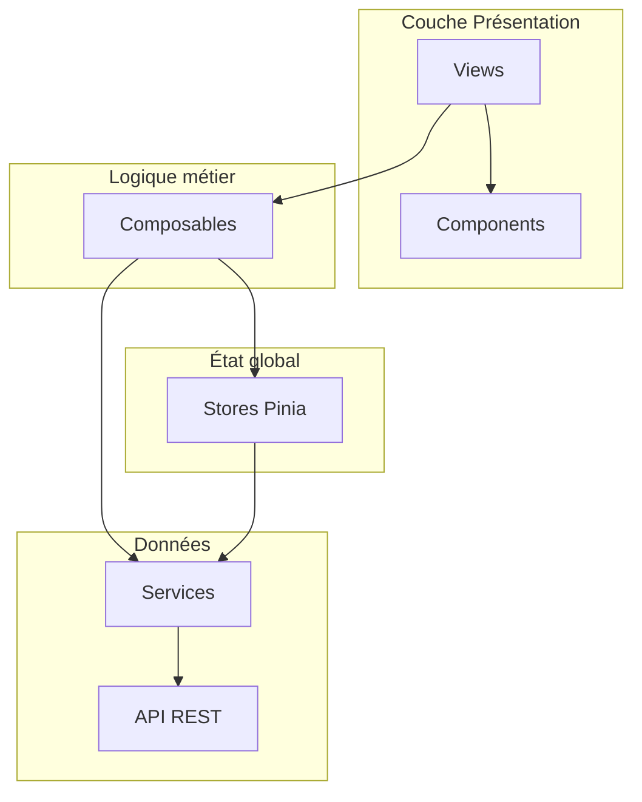
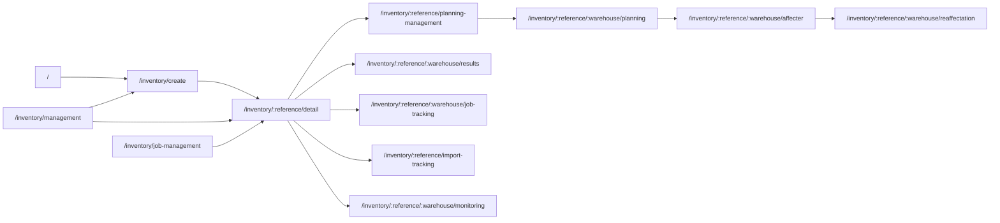
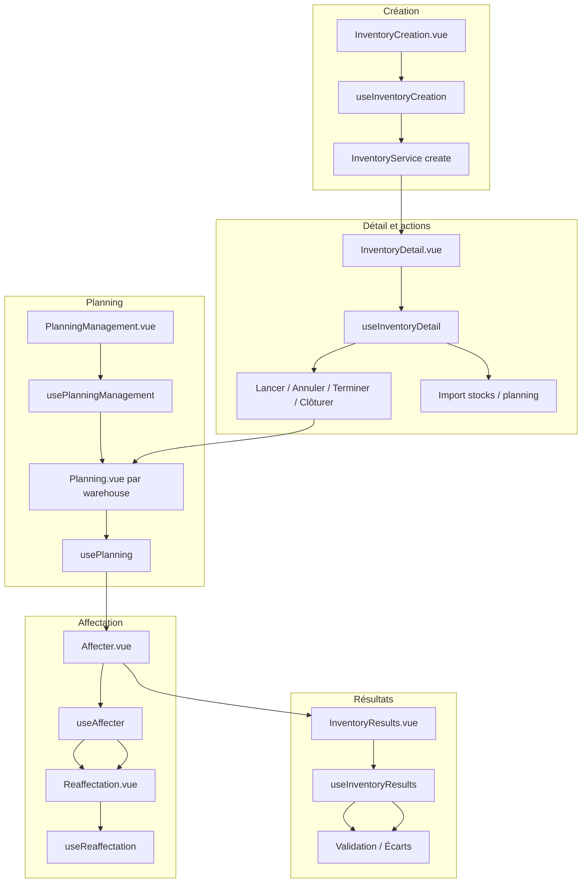
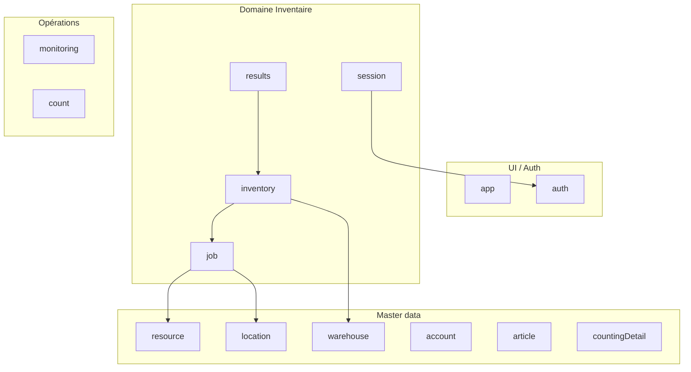
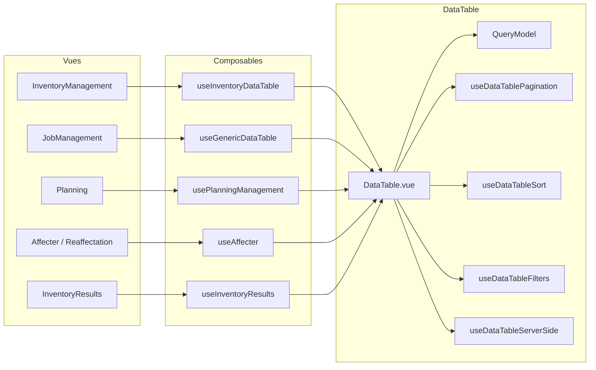

# Plan de projet complet – inventaireModuleWMSFront

## Contexte

Application Vue 3 (Composition API) + TypeScript + Vite + Pinia + Vue Router pour la gestion d’inventaires WMS. Le front s’appuie sur une API REST (`VITE_API_BASE_URL`) et des endpoints modulaires définis dans [src/api/index.ts](src/api/index.ts).

---

## 1. Stack technique

- **Framework** : Vue 3, Vue Router 4, Pinia (avec persistedstate)
- **Build** : Vite 3, TypeScript
- **UI** : Tailwind CSS, composants custom (DataTable, Form, Wizard), @SMATCH-Digital-dev/vue-system-design
- **HTTP** : Axios (config dans [src/utils/axiosConfig.ts](src/utils/axiosConfig.ts))
- **i18n** : vue-i18n

---

## 2. Architecture en couches

Les écrans suivent le flux : **Vue** → **Composable** → **Store** (optionnel) → **Service** → **API**.

- **Views** : pages sous [src/views/](src/views/) (Inventory, auth, errors).
- **Components** : [DataTable](src/components/DataTable/), [Form](src/components/Form/), modales (JobAffectationModal, AffectationModal), layouts (app-layout, auth-layout, monitoring-layout).
- **Composables** : logique réutilisable par écran (useAffecter, usePlanningManagement, useInventoryDetail, useInventoryResults, etc.) dans [src/composables/](src/composables/).
- **Stores** : [src/stores/](src/stores/) — inventory, results, job, session, location, warehouse, resource, account, monitoring, auth, app, etc.
- **Services** : [src/services/](src/services/) — InventoryService, jobService, SessionService, inventoryResultsService, LocationService, MonitoringService, etc.
- **API** : base URL + endpoints dans [src/api/index.ts](src/api/index.ts) (auth, inventory, job, warehouse, location, resource, account, inventoryResults, ecartComptage, article, countingDetail).

---

## 3. Routes et navigation

Routes principales (toutes `requiresAuth: true` sauf login et erreurs) :

- **Layout** : `app` par défaut ; `auth` pour login et 401/403/404 ; `monitoring` pour les vues monitoring.
- **Garde** : dans [src/router/index.ts](src/router/index.ts), `beforeEach` lit les tokens (cookie), impose `login` si `requiresAuth` et pas de token, et redirige vers `/` si déjà authentifié sur `/auth/login`.

---

## 4. Cycle de vie d’un inventaire

Flux métier typique (de la création à la clôture) :

- **Création** : [InventoryCreation.vue](src/views/Inventory/InventoryCreation.vue) (wizard), [useInventoryCreation](src/composables/useInventoryCreation.ts), store `inventory`.
- **Détail** : [InventoryDetail.vue](src/views/Inventory/InventoryDetail.vue), [useInventoryDetail](src/composables/useInventoryDetail.ts) — lancement, annulation, complétion, clôture, import, export PDF.
- **Planning** : [PlanningManagement.vue](src/views/Inventory/PlanningManagement.vue) (vue par magasin), [Planning.vue](src/views/Inventory/Planning.vue), [usePlanningManagement](src/composables/usePlanningManagement.ts), [usePlanning](src/composables/usePlanning.ts).
- **Affectation** : [Affecter.vue](src/views/Inventory/Affecter.vue) + [Reaffectation.vue](src/views/Inventory/Reaffectation.vue), [useAffecter](src/composables/useAffecter.ts), [useReaffectation](src/composables/useReaffectation.ts), JobAffectationModal.
- **Résultats** : [InventoryResults.vue](src/views/Inventory/Results/InventoryResults.vue), [useInventoryResults](src/composables/useInventoryResults.ts), store `results`, inventoryResultsService, EcartComptageService.

---

## 5. Stores Pinia et dépendances

- **inventory** : liste paginée, inventaire courant, CRUD, launch/cancel/complete/close, import, export.
- **job** : jobs, affectations équipe/ressource, locations, validation, écarts.
- **results** : résultats par magasin, validation, résolution d’écarts.
- **session** : sessions et utilisateurs mobiles par ordre de comptage.
- **location**, **warehouse**, **resource**, **account** : données de référence utilisées par les vues et services.

---

## 6. Intégration DataTable

Le composant DataTable est le bloc commun pour les listes paginées (inventaires, jobs, locations, planning, résultats).

- **Composant** : [src/components/DataTable/](src/components/DataTable/) — DataTable.vue, ColumnManager, Toolbar, Pagination, filtres, cellules éditables.
- **Composables DataTable** : dans `DataTable/composables/` (pagination, tri, recherche, filtres, serveur, export, édition, etc.) ; QueryModel et paramètres standard pour l’API.
- **Composables métier** : useGenericDataTable, useInventoryDataTable (conversion QueryModel / params), usePlanningManagement, useAffecter, useInventoryResults alimentent les vues et pilotent le DataTable.

---

## 7. API et services

- **Configuration** : [src/api/index.ts](src/api/index.ts) — `baseURL`, `endpoints` (auth, inventory, job, warehouse, location, resource, account, inventoryResults, ecartComptage, article, countingDetail).
- **Axios** : [src/utils/axiosConfig.ts](src/utils/axiosConfig.ts) — intercepteurs, timeout, baseURL.
- **Services principaux** :
  - **InventoryService** : CRUD, infos (basic, account, warehouses, countings, team, resources), launch/cancel/complete/close, import stocks/planning, export CSV/Excel/PDF.
  - **jobService** : liste DataTable, CRUD, affectations, locations, validation, écarts.
  - **inventoryResultsService** : résultats par inventaire/magasin, validation, export.
  - **EcartComptageService** : résolution d’écarts (simple et bulk).
  - **SessionService** : utilisateurs mobiles par comptage.
  - **LocationService**, **WarehouseService**, **ResourceService**, **AccountService**, **ArticleService**, **CountingDetailService**, **MonitoringService** : domaine respectif.

---

## 8. Fichiers clés à retenir

| Rôle               | Fichiers                                                                                                                                                                     |
| ------------------ | ---------------------------------------------------------------------------------------------------------------------------------------------------------------------------- |
| Point d’entrée     | [main.ts](src/main.ts), [router/index.ts](src/router/index.ts)                                                                                                               |
| Layouts            | [layouts/app-layout.vue](src/layouts/app-layout.vue), auth-layout, monitoring-layout                                                                                         |
| Config API         | [api/index.ts](src/api/index.ts), [utils/axiosConfig.ts](src/utils/axiosConfig.ts)                                                                                           |
| Stores             | [stores/inventory.ts](src/stores/inventory.ts), [stores/job.ts](src/stores/job.ts), [stores/results.ts](src/stores/results.ts), [stores/session.ts](src/stores/session.ts)   |
| Cycle inventaire   | InventoryCreation.vue, InventoryDetail.vue, PlanningManagement.vue, Planning.vue, Affecter.vue, Reaffectation.vue, InventoryResults.vue                                      |
| Composables métier | useInventoryCreation, useInventoryDetail, usePlanningManagement, usePlanning, useAffecter, useReaffectation, useInventoryResults, useGenericDataTable, useInventoryDataTable |
| DataTable          | [DataTable/DataTable.vue](src/components/DataTable/DataTable.vue), [DataTable/composables/](src/components/DataTable/composables/)                                           |
| Modèles            | [models/](src/models/), [interfaces/](src/interfaces/)                                                                                                                       |

Ce plan sert de référence pour l’architecture, les flux et les zones à modifier (nouvelle fonctionnalité, refactoring, correction de bug).