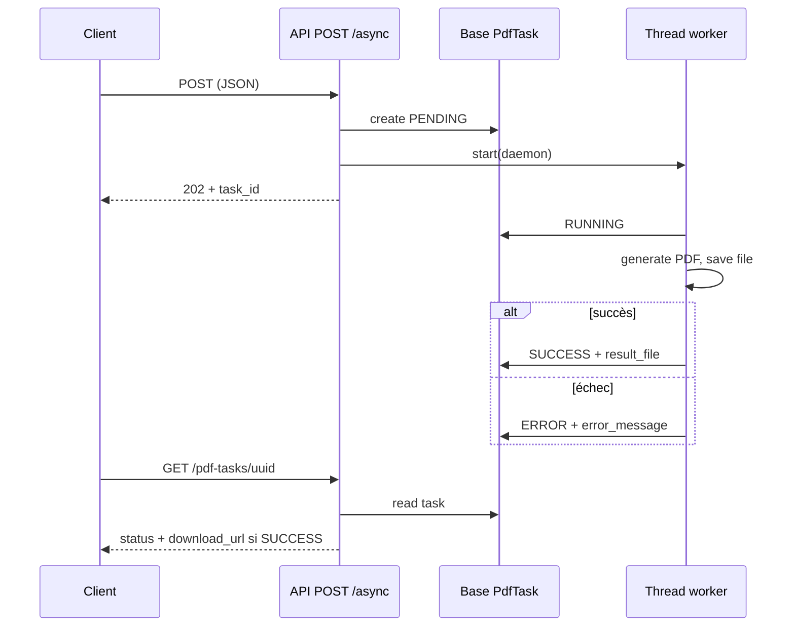

# API — génération de PDF d’inventaire (documentation détaillée)

Toutes les URL ci-dessous sont **préfixées par** ` /web/api/ ` (inclusion dans `project/urls.py` : `path('web/api/', include('apps.inventory.urls'))`).

| URL absolue type | Exemple |
|------------------|---------|
| `https://<hôte>/web/api/inventory/12/jobs/pdf/` | … |

---

## En-têtes et format

| En-tête | Valeur / remarque |
|---------|-------------------|
| `Authorization` | **Obligatoire** (sauf configuration projet modifiée) : `Bearer <access_token_jwt>`. DRF : `IsAuthenticated` par défaut. |
| `Content-Type` | `application/json` pour les **POST** avec corps. |
| `Accept` | Optionnel : `application/json` (réponses d’erreur, `202`, `GET` statut) ou `application/pdf` (réponses `200` synchrones binaires). |

Les réponses **JSON** utilisent en général les champs `success` (booléen) et `message` (chaîne) ; le détail d’exception métier reprend souvent `error_type` sur les vues **synchrones** générant l’inventaire global.

**Code source principal** : `apps/inventory/views/pdf_views.py`  
**Use cases** : `apps/inventory/usecases/inventory_jobs_pdf.py`, `job_assignment_pdf.py`  
**Service / filtres** : `apps/inventory/services/pdf_service.py`, `apps/inventory/repositories/pdf_repository.py`  
**Tâches async** : modèle `PdfTask` dans `apps/inventory/models.py`

---

## Principe : synchrone vs asynchrone

| Mode | Protocole | Ce que reçoit le client tout de suite |
|------|------------|--------------------------------------|
| **Synchrone** | `POST` → **`200`** | Fichier **PDF** dans le corps (`Content-Type: application/pdf`). |
| **Asynchrone** | `POST` → **`202`** | **JSON** avec `task_id` (UUID) ; la génération continue dans un **thread** (`threading.Thread`, `daemon=True`). **Pas de Celery.** |
| **Suivi** | `GET` → **`200`** | **JSON** : état de la tâche ; `download_url` seulement si génération **réussie** et fichier enregistré. |

**Cycle de vie d’une tâche** (`PdfTask.status`) :

1. `PENDING` — création en base, fil d’exécution pas encore allé au bout de `RUNNING` (fenêtre courte).
2. `RUNNING` — le thread a repris la tâche, `error_message` est effacé.
3. `SUCCESS` — PDF écrit sur `result_file` (dossier upload `pdf_tasks/`), champs `status` + `result_file` sauvegardés.
4. `ERROR` — exception dans le thread ; `error_message` contient le texte d’erreur (trace côté logs serveur).

Les workers thread appellent `close_old_connections()` en entrée / sortie pour limiter les soucis de connexions ORM en contexte **non requête**.

**Limites d’exploitation** (à connaître) :

- Redémarrage du processus web **pendant** `RUNNING` : la tâche peut rester bloquée en état intermédiaire ou ne pas se terminer comme prévu (pas de file durable).
- Téléchargement : `download_url` est une URL **absolue** construite par `request.build_absolute_uri(result_file.url)` — selon `MEDIA_URL` / service de fichiers, l’accès direct peut exiger d’**être authentifié côté nginx** ou d’**exposer** les fichiers médias selon la politique de déploiement (à vérifier en infra).

---

## Filtre métier : assignments / jobs (PDF inventaire global)

Ces règles viennent de `pdf_repository.get_assignments_by_inventory` (appelé par `PDFService.generate_inventory_jobs_pdf`).

### Cas par défaut (routes sync et async **sans** chemin « finished-assignments »)

Lorsque `assignment_statuses` et `job_statuses` ne sont **pas** fournis au repository (c’est le cas du **use case** pour les vues `InventoryJobsPdfView` et `InventoryJobsPdfAsyncStartView` : ils passent `None` / n’invoquent pas les paramètres supplémentaires) :

- **Assignments** : seuls les statuts **`PRET`** et **`TRANSFERT`** sont retenus.
- **Jobs** : seuls les statuts **`PRET`** et **`TRANSFERT`** sont retenus (filtre `job__status__in=…`).

Si `job_ids` est fourni (body `job` / `job[]`), on restreint en plus aux jobs dont l’ID est dans la liste, **en conservant** les mêmes filtres de statut par défaut.

### Cas spécifique : route `.../finished-assignments/async/`

Le contrôleur crée une `PdfTask` avec notamment :

- `assignment_statuses: ["TERMINE"]`
- `job_statuses: []` (liste **vide**)

Dans le repository, si `job_statuses` vaut `[]` **sans** être `None`, alors `effective_job_statuses` est `[]`. La condition `if effective_job_statuses:` est **fausse** pour une liste vide : **aucun filtre n’est appliqué sur le statut du job** (`job__status` n’est pas restreint). En revanche, les assignments sont filtrés sur **`TERMINE`**.

Après un **`SUCCESS`**, le thread exécute (si `assignment_ids_to_mark` est défini) :

```text
Assigment.objects.filter(id__in=…, imprime=False).update(imprime=True, imprime_date=now())
```

Seuls les enregistrements encore `imprime=False` sont mis à jour (cohérent avec la sélection initiale).

---

## Tableau des endpoints

| # | Méthode | Chemin relatif (sous `web/api/`) | Nom Django | Réponse type |
|---|--------|-----------------------------------|------------|--------------|
| 1 | `POST` | `inventory/<id>/jobs/pdf/` | `inventory-jobs-pdf` | `200` PDF |
| 2 | `POST` | `inventory/<id>/jobs/pdf/async/` | `inventory-jobs-pdf-async` | `202` JSON |
| 3 | `POST` | `inventory/<iid>/warehouse/<wid>/jobs/pdf/finished-assignments/async/` | `inventory-warehouse-finished-assignments-pdf-async` | `202` JSON ou `404` JSON |
| 4 | `POST` | `jobs/<jid>/assignments/<aid>/pdf/` | `job-assignment-pdf` | `200` PDF |
| 5 | `POST` | `jobs/<jid>/assignments/<aid>/pdf/async/` | `job-assignment-pdf-async` | `202` JSON |
| 6 | `GET` | `pdf-tasks/<uuid:task_id>/` | `pdf-task-status` | `200` JSON ou `404` JSON |

Le paramètre `task_id` du **GET** est l’**UUID** (`PdfTask.id`) retourné dans les `202`.

---

## 1. `POST …/inventory/<inventory_id>/jobs/pdf/` (synchrone)

**Classe** : `InventoryJobsPdfView`

### Entrée

- **URL** : `inventory_id` — entier (positif en usage normal).
- **Body JSON** (tout est optionnel) :
  - `job` **ou** `job[]` : scalaire entier, liste d’entiers, ou **chaîne** d’entiers séparés par des **virgules** (espaces autour des nombres acceptés). Parser : `_parse_job_ids_from_request_data`.

### Règles de filtrage (résumé)

- Comptages : **tous** les comptages de l’inventaire, triés par `order` (côté service).
- Assignments : défaut `PRET` + `TRANSFERT` (voir section filtres) ; `job_ids` restreint la liste de jobs si fourni.

### Réussite : `200 OK`

| Entête | Valeur |
|--------|--------|
| `Content-Type` | `application/pdf` |
| `Content-Disposition` | `attachment; filename="Job inventaire (<ref_inventaire>).pdf"` (si inventaire introuvable, repli : id numérique) |
| `Content-Length` | Taille en octets |

Le corps binaire est le PDF.

### Erreurs (JSON) — `InventoryJobsPdfView` uniquement

Toutes les erreurs ci-dessous renvoient du **JSON** (pas de PDF). Les structures typiques : `{ "success": false, "message": "…", "error_type": "…" }` (le champ `error_type` n’est **pas** systématique sur toutes les branches ; voir table).

| HTTP | Origine (résumé) | `error_type` / remarque |
|------|------------------|-------------------------|
| **400** | Échec conversion `job` / `job[]` | Message : *job doit être une liste d'entiers ou un entier* |
| **400** | `inventory_id` absent / falsy côté vue | Rare avec route Django `<int:…>` |
| **400** | `ValueError`, `PDFValidationError`, `DjangoValidationError` | `validation_error` |
| **400** | Autres messages de validation | souvent `validation_error` |
| **404** | `PDFNotFoundError` | `not_found` |
| **404** | `PDFEmptyContentError` (aucune donnée affichable) | `empty_content` |
| **500** | Buffer vide **après** `success` use case, ou en-tête non `%PDF` | Pas d’`error_type` spécifique dans le fragment retourné (messages textuels) |
| **500** | Use case retourne `success=False` sans exception | Message générique génération |
| **500** | `PDFServiceError`, `PDFRepositoryError` | `service_error` |
| **500** | `PDFGenerationError` | `generation_error` |
| **500** | Exception inattendue | `internal_error` |

**Note** : le message d’`PDFEmptyContentError` côté service évoque les jobs en **PRET ou TRANSFERT** et des `job_details`— utile pour le support.

---

## 2. `POST …/inventory/<inventory_id>/jobs/pdf/async/`

**Classe** : `InventoryJobsPdfAsyncStartView`

- Même sémantique de body que **§1** (parser identique). Paramètres passés en `PdfTask.params` : `inventory_id`, `job_ids` (peut être `null`).
- Aucune validation HTTP de l’existence de l’inventaire **avant** le `202` : l’échec éventuel se verra en **`ERROR`** sur la tâche au poll.

### Réponses

**202 Accepted** — démarrage enregistré :

```json
{
  "success": true,
  "task_id": "550e8400-e29b-41d4-a716-446655440000",
  "status": "PENDING"
}
```

`task_id` = `str(uuid)`.

**400 Bad Request** — uniquement si parsing `job` / `job[]` échoue (même message que §1) **ou** si `inventory_id` est considéré absent (falsy) par la garde de la vue.

**Erreurs métier** (inventaire inconnu, PDF vide, etc.) : **non renvoyées** sur le `POST` ; consulter `GET …/pdf-tasks/<task_id>/` avec `status: "ERROR"` et `error_message`.

**Type de tâche** : `task_type` = `inventory_jobs_pdf` (valeur en base : voir `PdfTask.TYPE_INVENTORY_JOBS_PDF`).

**Après succès** : le fichier est nommé comme en synchrone, ex. `Job inventaire (<ref>).pdf` sur `result_file`. Pas de mise à jour `imprime` sur les assignments (contrairement à §3).

---

## 3. `POST …/inventory/<inventory_id>/warehouse/<warehouse_id>/jobs/pdf/finished-assignments/async/`

**Classe** : `InventoryWarehouseFinishedAssignmentsPdfAsyncStartView`

### Sélection en base (avant création de tâche)

Filtre `Assigment` :

- `job__inventory_id` = `inventory_id`
- `job__warehouse_id` = `warehouse_id`
- `status` = `"TERMINE"`
- `imprime` = `False`

### Si aucun enregistrement

**404 Not Found** — pas de `PdfTask` créée.

```json
{
  "success": false,
  "message": "Aucun assignment TERMINE non imprimé trouvé pour cet inventaire et entrepôt"
}
```

### Si au moins un enregistrement — **202 Accepted**

```json
{
  "success": true,
  "task_id": "<uuid>",
  "status": "PENDING",
  "jobs_count": <int>,
  "assignments_count": <int>
}
```

- `jobs_count` : nombre d’**IDs de jobs distincts** parmi les assignments sélectionnés.
- `assignments_count` : nombre d’**assignments** sélectionnés.

`PdfTask.params` contient entre autres : `job_ids`, `assignment_statuses: ["TERMINE"]`, `job_statuses: []`, `assignment_ids_to_mark: [<ids>]`. Le worker applique le filtrage repository décrit en tête de document, puis tente génération + marquage `imprime` en cas de succès.

**400** : si `inventory_id` **ou** `warehouse_id` est falsy (ex. théorique `0`).

---

## 4. `POST …/jobs/<job_id>/assignments/<assignment_id>/pdf/` (synchrone)

**Classe** : `JobAssignmentPdfView`

### Body (optionnel)

| Champ | Type | Description |
|-------|------|-------------|
| `equipe_id` | entier ou absent / `null` | Filtrage « équipe » côté use case (personnes affectées) ; si non entier : **400**. |

### Réussite : `200 OK`

- `Content-Type: application/pdf`
- `Content-Disposition: attachment; filename="FICHE DE COMPTAGE : <référence_job>.pdf"`
- Repli sur le nom de fichier : `job_<job_id>` si le job n’existe pas (référence de nom).

### Erreurs (JSON)

| HTTP | Cas |
|------|-----|
| **400** | `equipe_id` présent mais non convertible en entier |
| **400** | `ValueError` remonté par le use case |
| **500** | `result['success']` faux sans exception, ou autre `Exception` — message *Erreur interne : …* avec le texte d’exception pour cette dernière |

**Note** : pas d’`error_type` structuré comme sur `InventoryJobsPdfView` ; les messages varient.

---

## 5. `POST …/jobs/<job_id>/assignments/<assignment_id>/pdf/async/`

**Classe** : `JobAssignmentPdfAsyncStartView`

- `equipe_id` : si clé absente, `null`, ou `""` → enregistré tel quel (ultérieurement `None` dans le thread). Toute autre valeur doit être un entier valide, sinon **400** avec *equipe_id doit etre un nombre entier*.

**202 Accepted** :

```json
{
  "success": true,
  "task_id": "<uuid>",
  "status": "PENDING"
}
```

**Type de tâche** : `job_assignment_pdf` (`PdfTask.TYPE_JOB_ASSIGNMENT_PDF`).

Échec ultérieur : uniquement via statut tâche `ERROR`.

---

## 6. `GET …/pdf-tasks/<task_id>/`

**Classe** : `PdfTaskStatusView`  
`task_id` : UUID (format chaîne standard).

### 404

```json
{
  "success": false,
  "message": "Tâche PDF introuvable"
}
```

### 200 — tâche existante (tous les états)

Champs communs :

```json
{
  "success": true,
  "task_id": "<uuid>",
  "task_type": "inventory_jobs_pdf",
  "status": "RUNNING",
  "error_message": null
}
```

- `task_type` : `inventory_jobs_pdf` **ou** `job_assignment_pdf` (valeurs exactes = constantes `PdfTask`).
- `status` : `PENDING` | `RUNNING` | `SUCCESS` | `ERROR`.
- `error_message` : `null` si pas d’erreur, sinon texte (utile quand `status` = `ERROR`).

**Condition supplémentaire pour le téléchargement** : si `status` = `SUCCESS` **et** `result_file` est renseigné, le serveur ajoute :

```json
"download_url": "https://<hôte absolu>/…/media/pdf_tasks/…"
```

Si `SUCCESS` sans fichier (anomalie), `download_url` est **absent**.

**Polling recommandé** : intervalle progressif (ex. 0,5 s → 1 s → 2 s), timeout global côté client, arrêt sur `SUCCESS` ou `ERROR`.

---

## Exemples d’enchaînement

### Synchrone — PDF inventaire global

```http
POST /web/api/inventory/12/jobs/pdf/ HTTP/1.1
Host: example.com
Authorization: Bearer <token>
Content-Type: application/json
Content-Length: 2

{}
```

### Asynchrone — lancer puis suivre

**Étape A** — lancer :

```http
POST /web/api/inventory/12/jobs/pdf/async/ HTTP/1.1
Authorization: Bearer <token>
Content-Type: application/json

{"job": [101, 102, 103]}
```

**Étape B** — statut (répéter jusqu’à terminaison) :

```http
GET /web/api/pdf-tasks/550e8400-e29b-41d4-a716-446655440000/ HTTP/1.1
Authorization: Bearer <token>
```

**Étape C** — si `download_url` présent, client HTTP (navigateur ou appli) sur cette URL. Selon la config **media**, ajouter l’auth si nécessaire.

### Assignments terminés non imprimés (entrepôt 7)

```http
POST /web/api/inventory/12/warehouse/7/jobs/pdf/finished-assignments/async/ HTTP/1.1
Authorization: Bearer <token>
Content-Type: application/json

{}
```

### Fiche de comptage asynchrone

```http
POST /web/api/jobs/55/assignments/99/pdf/async/ HTTP/1.1
Authorization: Bearer <token>
Content-Type: application/json

{"equipe_id": 3}
```

---

## Référence des fichiers

| Fichier | Rôle |
|---------|------|
| `apps/inventory/urls.py` | Déclaration des `path(…, name=…)` |
| `apps/inventory/views/pdf_views.py` | Vues, threads `_run_*`, parsing `job` |
| `apps/inventory/models.py` | `PdfTask` (UUID, `params` JSON, `result_file`, statuts) |
| `apps/inventory/usecases/inventory_jobs_pdf.py` | Orchestration `InventoryJobsPdfUseCase.execute` |
| `apps/inventory/repositories/pdf_repository.py` | `get_assignments_by_inventory` (filtres PRET/TRANSFERT / surcharges) |
| `apps/inventory/services/pdf_service.py` | `generate_inventory_jobs_pdf`, construction du PDF |
| `apps/inventory/usecases/job_assignment_pdf.py` | Fiche de comptage par job/assignment |

---

## Diagramme de séquence (async simplifié)



---

*Dernière mise à jour : alignée sur `apps/inventory/views/pdf_views.py` (threads sans Celery, `PdfTask`, handlers d’exception de la vue synchrone inventaire).*
