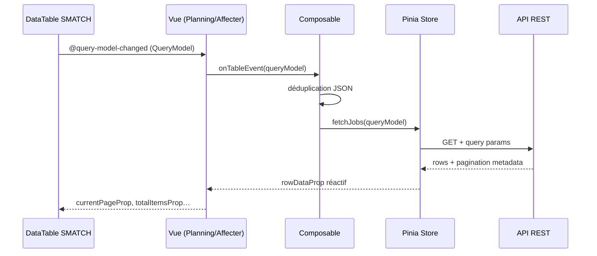

# Rapport d'architecture — inventaireModuleWMSFront

**Date :** 22 mai 2026  
**Rôle :** analyse architecturale (vue système)  
**Périmètre :** application front-end SPA du module inventaire WMS  
**Backend cible :** API REST Django (inférée via endpoints `src/api/index.ts`)

---

## 1. Synthèse exécutive

`inventaireModuleWMSFront` est une **SPA Vue 3** dédiée à la gestion du cycle de vie des inventaires en entrepôt : création, planification des jobs, affectation des équipes, suivi des comptages, résultats, monitoring et KPI.

L'architecture suit un modèle **en couches** classique et cohérent pour le domaine métier :

```
Views (pages) → Composables (orchestration) → Stores Pinia / Services → Axios → API REST
```

**Forces principales :**
- Séparation claire par domaine inventaire (`Planning`, `Affecter`, `Results`, `Monitoring`…)
- Design system SMATCH (`@SMATCH-Digital-dev/vue-system-design`) comme socle UI
- Pattern DataTable server-side documenté (`DATATABLE.md`, `DATATABLE_COMPOSABLE_PATTERN.md`)
- Catalogue d'endpoints centralisé (`src/api/index.ts`)
- CI minimale (lint + build + audit npm)

**Risques structurels (réduits en mai 2026) :**
- Composables volumineux restants (`affecter/index.ts`, `results/index.ts`) — découpage partiel en sous-modules
- Couplage fort au package design system (workarounds Vite, `globalThis`)
- Dette AG Grid (`LaunchJobs.vue`) — conservé tant que l'écran n'est pas migré vers DataTable SMATCH
- Sécurité auth : JWT en cookies JS ; RBAC front ajouté (`meta.roles`, fallback permissif si claims absents)

| Dimension | Note | Commentaire |
|-----------|------|-------------|
| Modularité métier | **8/10** | Router modulaire, `features/inventory/`, composables découpés |
| Maintenabilité | **7/10** | `dataTable/`, modules planning/affecter/results/jobTracking |
| Évolutivité | **7/10** | Pattern composable + ADR `docs/adr/001-datatable-handler.md` |
| Qualité / tests | **6/10** | Vitest (28+ tests), Playwright smoke en CI |
| Sécurité front | **5,5/10** | RBAC guard ; HttpOnly à coordonner avec backend |
| Documentation | **8/10** | DataTable, ADR, ce rapport mis à jour |
| **Score global** | **7/10** | Phases 1–3 du plan d'amélioration implémentées (mai 2026) |

---

## 2. Contexte et objectifs du système

### 2.1 Mission fonctionnelle

L'application supporte les opérateurs WMS dans :

| Capacité | Écrans / routes | Composable(s) clé(s) |
|----------|-----------------|----------------------|
| Gestion des inventaires | `/inventory/management` | `useInventoryManagement` |
| Création / édition | `/inventory/create`, `/:reference/edit` | `useInventoryCreation` |
| Détail inventaire | `/inventory/:reference/detail` | `useInventoryDetail` |
| Planification jobs | `/:reference/:warehouse/planning` | `usePlanning` |
| Affectation équipes | `/:reference/:warehouse/affecter` | `useAffecter` |
| Réaffectation | `/:reference/:warehouse/reaffectation` | `useReaffectation` |
| Résultats & écarts | `/:reference/:warehouse/results` | `useInventoryResults` |
| Suivi jobs | `/:reference/:warehouse/job-tracking` | `useJobTracking` |
| Monitoring temps réel | `/:reference/:warehouse/monitoring` | `useMonitoring` |
| KPI dashboard | `/:reference/:warehouse/kpi-dashboard` | `useInventoryKpiDashboard` |
| PDF async | `/:reference/:warehouse/generated-pdfs` | `useInventoryJobsPdfAsyncRunner` |
| Lancement jobs | `/inventory/launch-jobs` | `useJobManagementPage` |

### 2.2 Utilisateurs cibles

- **Planificateurs** : création jobs, validation, gestion emplacements
- **Responsables d'affectation** : équipes 1er/2e comptage, ressources
- **Contrôleurs** : résultats, écarts, suivi
- **Superviseurs** : monitoring, KPI

### 2.3 Contraintes techniques

- Déploiement : Docker, Jenkins, Vercel (fichiers présents à la racine)
- Design system propriétaire SMATCH (version `^1.1.30`)
- Backend multi-préfixes : `/web/api/`, `/masterdata/api/`, `/mobile/api/`

---

## 3. Vue d'ensemble architecturale

### 3.1 Diagramme des couches

```mermaid
flowchart TB
    subgraph Presentation["Couche présentation"]
        V[Views .vue]
        C[Components réutilisables]
        L[Layouts app / auth / monitoring]
    end

    subgraph Application["Couche application"]
        CP[Composables feature]
        UC[Usecases CountingDispatcher]
        BR[Breadcrumb / meta]
    end

    subgraph State["État & cache"]
        PS[Pinia Stores x15]
    end

    subgraph Infrastructure["Infrastructure"]
        SV[Services HTTP x26]
        AX[axiosConfig + axiosBase]
        API[src/api/index.ts]
        NORM[Normalizers DataTable]
    end

    subgraph External["Externe"]
        BE[API REST Django]
        DS[@SMATCH vue-system-design]
    end

    V --> CP
    V --> C
    V --> L
    CP --> PS
    CP --> SV
    CP --> UC
    PS --> SV
    SV --> AX
    AX --> API
    API --> BE
    V --> DS
    C --> DS
    SV --> NORM
```

### 3.2 Pattern dominant : « Smart Composable + Thin View »

Les vues (`src/views/Inventory/*.vue`) restent relativement minces : elles bindent le `DataTable` SMATCH, les composants SDS (`Card`, `Button`, `Dialog`) et délèguent la logique aux composables.

**Exemple de flux DataTable (server-side) :**



Ce pattern est aligné avec `DATATABLE.md` et `useInventoryManagement.ts` (référence interne).

---

## 4. Stack technique

| Catégorie | Technologie | Version | Rôle |
|-----------|-------------|---------|------|
| Framework | Vue | 3.2 | UI réactive, Composition API |
| Routing | Vue Router | 4.1 | ~20 routes métier, lazy loading |
| État | Pinia | 2.0 | Stores par domaine |
| Persistance | pinia-plugin-persistedstate | 2.4 | Installé, peu utilisé |
| Build | Vite | 3.1 | Dev server, chunks manuels |
| Langage | TypeScript | 4.6 | `noImplicitAny: false` |
| Styles | Tailwind CSS | 3.3 | Tokens SMATCH via `theme.package.cjs` |
| UI kit | @SMATCH-Digital-dev/vue-system-design | 1.1.30 | DataTable, AppLayout, formulaires |
| Icônes | @mdi/font | 7.4 | Migration en cours depuis SVG template |
| HTTP | Axios | 1.13 | Intercepteurs refresh token |
| i18n | vue-i18n | 9.14 | Locales `src/locales/` |
| Validation | Vuelidate | 2.0 | Formulaires |
| Notifications | SweetAlert2 | 11.x | `alertService` |
| Export | jsPDF, xlsx | — | PDF / Excel |
| Grille legacy | ag-grid-vue3 | 33.x | Usage marginal (`LaunchJobs.vue`) |

**Dépendances héritées du template** (candidats au nettoyage) : FullCalendar, ApexCharts, Quill, Swiper, nombreuses vues `auth/boxed-*`, `font-icons`, `dragndrop`, ~150 composants `icon/*.vue`.

---

## 5. Structure du dépôt

```
inventaireModuleWMSFront/
├── src/
│   ├── views/           # Pages routées (Inventory/, auth/, errors/)
│   ├── composables/     # ~35 composables métier + helpers DataTable
│   ├── components/      # UI réutilisable (Form/, layout/, Inventory/)
│   ├── stores/          # 15 stores Pinia
│   ├── services/        # ~26 services HTTP
│   ├── api/             # Registre endpoints
│   ├── models/          # Entités métier
│   ├── interfaces/      # DTO, configs UI
│   ├── usecases/        # Règles métier (CountingDispatcher)
│   ├── utils/           # Axios, cookies, normalizers, PDF
│   ├── constants/       # jobStatus, brand, etc.
│   ├── theme/           # Bridge thème SMATCH / Prolog IMS
│   ├── layouts/         # app-layout, auth-layout
│   ├── router/          # Router monolithique
│   └── locales/         # i18n
├── public/              # Assets statiques
├── docs/                # Palette couleurs
├── DATATABLE.md         # Référence DataTable (~1000 lignes)
├── AUDIT.md             # Audit sécurité / qualité
└── .github/workflows/   # CI
```

---

## 6. Couches détaillées

### 6.1 Présentation — Views & Components

**Principe :** une vue par capacité métier, props de route (`reference`, `warehouse`) injectées via `props: route => ({...})`.

**Layouts :**
- `app-layout` — shell SMATCH + sidebar dynamique (`routeToNavItems.ts`)
- `auth-layout` — login, erreurs 401/403/404
- `monitoring-layout` — monitoring plein écran

**Composants notables :**
- `MdiIcon.vue` — wrapper MDI (migration design system)
- `Form/*` — champs métier (SelectField, ButtonGroup, wizard)
- `Inventory/*` — modales inventaire
- `InventoryKpi/*` — dashboard KPI (en cours)
- `ExcelGrid/` — grille type Excel

### 6.2 Application — Composables

**Organisation :** un composable principal par écran lourd.

| Fichier | Lignes | Responsabilités |
|---------|--------|-----------------|
| `useAffecter.ts` | ~2 745 | Affectation, édition inline, modales, bulk actions |
| `useInventoryResults.ts` | ~2 206 | Résultats, écarts, exports, master-detail |
| `useJobTracking.ts` | ~1 599 | Suivi jobs, statuts, actions |
| `usePlanning.ts` | ~1 446 | 2 DataTables (jobs + locations), bulk |
| `useInventoryDetail.ts` | ~885 | Navigation entrepôts, actions |
| `useInventoryManagement.ts` | ~734 | Liste inventaires, imports |

**Composables transverses DataTable :**
- `useGenericDataTable.ts`, `useInventoryDataTable.ts`
- `useDataTableFilters.ts`, `useDataTableOptimizations.ts`
- `useInventoryResults.constants.ts` — constantes partagées

**Anti-pattern identifié :** dans `useAffecter.ts`, certains stores Pinia sont instanciés **au niveau module** (hors fonction composable), créant un état partagé global non isolé par instance.

**Recommandation :** découper chaque god composable en sous-modules :
```
useAffecter/
  ├── index.ts           # façade publique
  ├── useAffecterTable.ts
  ├── useAffecterModals.ts
  ├── useAffecterBulk.ts
  └── useAffecterColumns.ts
```

### 6.3 Domaine — Usecases

`src/usecases/CountingDispatcher.ts` applique le **Strategy pattern** pour valider les comptages selon le mode (`par article`, `en vrac`, `image de stock`).

C'est le seul îlot DDD explicite. **Opportunité :** étendre ce pattern aux règles de validation jobs, affectations et transitions de statut.

### 6.4 État — Pinia Stores

| Store | Rôle |
|-------|------|
| `useInventoryStore` | Inventaires, détails, CRUD |
| `useJobStore` | Jobs, pagination, affectations |
| `useLocationStore` | Emplacements non affectés |
| `useWarehouseStore` | Entrepôts |
| `useResourceStore` | Ressources / équipes |
| `useResultsStore` | Résultats inventaire |
| `useMonitoringStore` | Données monitoring |
| `useSessionStore` | Sessions mobiles |
| `useAuthStore` | Auth (Options API) |
| `useAppStore` (`stores/index.ts`) | Shell UI, thème, sidebar |

**Incohérence :** `stores/app.ts` exporte `useGlobalStore` avec le même id Pinia `'app'` — **non utilisé**, source de confusion.

**Pattern store :** majoritairement Composition API ; stores appellent les services et exposent `paginationMetadata` pour le DataTable server-side.

### 6.5 Infrastructure — Services & API

**Registre :** `src/api/index.ts` centralise les préfixes REST.

**Couche HTTP :**
- `axiosBase.ts` — instance sans intercepteurs (auth, évite cycles)
- `axiosConfig.ts` — Bearer, refresh 401, logout, alertes

**Services (~26 fichiers) :** un service par agrégat (`InventoryService`, `jobService`, `InventoryKpiService`…).

**Normalisation :** `dataTableResponseNormalizer.ts`, `inventoryResultNormalizer.ts` — adaptation réponses backend → format DataTable.

---

## 7. Routing et navigation

**Fichier unique :** `src/router/index.ts` (~250 lignes, 20+ routes).

| Aspect | Implémentation |
|--------|----------------|
| Lazy loading | `import()` avec `webpackChunkName` sur quasi toutes les vues |
| Auth guard | `meta.requiresAuth` + cookies JWT (`getTokens()`) |
| Layout dynamique | `meta.layout` → `useAppStore.setMainLayout()` |
| Paramètres métier | `reference` (inventaire), `warehouse` (entrepôt) |
| Catch-all | Redirection vers `Error404` |

**Manques architecturaux :**
- Pas de modules router par domaine (`inventory.routes.ts`, `auth.routes.ts`)
- Pas de RBAC (rôles / permissions par route)
- Incohérence paramètres : `inventoryId/warehouseId` (monitoring pivot) vs `reference/warehouse` (reste)

---

## 8. Design system et thème

### 8.1 SMATCH Design System

Composants consommés : `DataTable`, `AppLayout`, `Card`, `Button`, `Dialog`, `Badge`, `Dropdown`, `QueryModel` utilities.

**Fragilité d'intégration :**
- Plugin Vite `fixSystemDesignImports.ts` — patch du bundle
- `optimizeDeps.exclude` sur le package
- `globalThis.useAppStore` et `globalThis.__appLogout` dans `main.ts`

Ces workarounds signalent un **couplage fort** et un risque de régression à chaque montée de version du package.

### 8.2 Thème Prolog IMS

- `src/theme/theme.package.cjs` — bridge CommonJS pour Tailwind
- `src/theme/colors.ts` — palette navy / accent / sémantique
- Classes utilitaires : `bg-app`, `text-muted`, `font-heading`, `font-body` (IBM Plex via config)
- Dark mode : classe `dark` sur `documentElement`

### 8.3 Migration icônes

En cours : passage des ~150 SVG `components/icon/*` vers **MDI** (`MdiIcon.vue`, `createMdiIconComponent.ts`). Les colonnes DataTable utilisent désormais `mdi-*` dans les écrans migrés (Planning, Affecter, Management).

---

## 9. Intégration backend

### 9.1 Cartographie API

| Préfixe | Domaine |
|---------|---------|
| `/web/api/inventory/` | Inventaires |
| `/web/api/jobs/` | Jobs |
| `/web/api/inventory-results/` | Résultats |
| `/web/api/ecarts-comptage/` | Écarts |
| `/web/api/pdf-tasks/` | Génération PDF async |
| `/masterdata/api/warehouses/` | Entrepôts |
| `/masterdata/api/locations/` | Emplacements |
| `/masterdata/api/accounts/` | Comptes |
| `/mobile/api/` | Articles, sync mobile |

### 9.2 Contrat DataTable

Le front communique avec le backend via **QueryModel** (pagination, tri, filtres, recherche globale, `customParams` métier). Conversion : `convertQueryModelToQueryParams`.

**Bonne pratique établie :** le composable ne manipule pas la config interne du DataTable ; il réagit uniquement à `@query-model-changed`.

---

## 10. Sécurité (vue architecte)

| Risque | Sévérité | État |
|--------|----------|------|
| JWT en cookies lisibles JS | Élevée | En attente cookies HttpOnly backend |
| `.env` potentiellement versionné | Élevée | `.env.example` ajouté — vérifier historique Git |
| Pas de RBAC front | Moyenne | Guard binaire `requiresAuth` |
| `v-html` notifications | Moyenne | Sanitisé via DOMPurify (`sanitizeHtml.ts`) |
| Dépendances vulnérables | Moyenne | `npm audit` CI (continue-on-error) |
| Pas de CSP / SRI documentés | Faible | Non implémenté |

Référence détaillée : `AUDIT.md`.

---

## 11. Qualité, CI/CD et observabilité

### 11.1 Pipeline CI (`.github/workflows/ci.yml`)

```
checkout → npm ci → lint:errors → build (vue-tsc + vite) → npm audit
```

**Présent :** lint ESLint 9, format Prettier, build TypeScript.  
**Absent :** tests unitaires, tests E2E, analyse bundle, couverture, SAST.

### 11.2 Tests

Aucun framework de test configuré (pas de Vitest, Cypress, Playwright).  
Fichiers ad hoc : `test-package.vue`, `TEST_PACKAGE.md` (tests manuels SMATCH).

### 11.3 Observabilité

- `loggerService.ts` — logging applicatif basique
- Pas de télémétrie (Sentry, OpenTelemetry) identifiée
- Pas de feature flags structurés (ex. KPI mock : constante locale)

---

## 12. Dette technique — inventaire priorisé

### 12.1 Critique (P0)

| Item | Impact | Action |
|------|--------|--------|
| Composables > 1 500 lignes | Maintenance, bugs, onboarding | Découpage par responsabilité |
| Aucun test automatisé | Régressions silencieuses | Vitest + tests composables DataTable |
| Couplage SMATCH (`globalThis`, plugin Vite) | Blocage upgrades | Contrat d'intégration avec l'équipe package |
| KPI en mock | Feature non production-ready | Brancher `InventoryKpiService` |

### 12.2 Important (P1)

| Item | Impact | Action |
|------|--------|--------|
| Router monolithique | Scalabilité routes | Modules par domaine |
| Double store `app` | Confusion Pinia | Supprimer `stores/app.ts` ou renommer |
| Stores instanciés hors composable | Fuites d'état | Déplacer dans `useAffecter()` |
| ~150 icônes SVG template | Poids bundle, incohérence | Finaliser migration MDI + purge |
| AG Grid installé, quasi inutilisé | Bundle size | Retirer ou documenter usage unique |
| TypeScript permissif | Bugs runtime | Activer `noImplicitAny` progressivement |

### 12.3 Souhaitable (P2)

| Item | Action |
|------|--------|
| Vues template hors router | Archiver ou supprimer |
| pinia-plugin-persistedstate inutilisé | Configurer ou retirer |
| Documentation architecture | Maintenir ce rapport + ADR |
| Uniformiser params route (`reference` vs `id`) | Convention unique |

---

## 13. Recommandations — feuille de route

### Phase 1 — Stabilisation ✅ (mai 2026)

1. ✅ **Vitest** + CI + tests (`dataTable/`, `CountingDispatcher`, normalizers, RBAC).
2. ✅ **Module `composables/dataTable/`** migré (Management, Planning, Affecter).
3. ✅ **Découpage** `affecter/`, `planning/` (bulk, actions, context, colonnes), `results/useResultsExport`.
4. ✅ **Stores Pinia** instanciés dans `useAffecter()`, plus au top-level module.
5. ✅ **KPI API** : `USE_INVENTORY_KPI_MOCK = false`.

### Phase 2 — Structuration ✅ (partiel)

1. ✅ **Router modulaire** : `src/router/modules/{inventory,auth,error}.routes.ts`.
2. ✅ **`features/inventory/`** : points d'entrée affecter + planning (réexport composables).
3. ⏳ **SMATCH `globalThis`** : documenté, migration progressive.
4. ✅ **RBAC** : `meta.roles` sur routes inventaire sensibles + `utils/rbac.ts`.
5. ✅ **Purge template** : vues `dragndrop`, `boxed-*` non routées supprimées.
6. ✅ **Store `app.ts`** : id Pinia `'global-shell'` (évite collision).
7. ⏳ **AG Grid** : conservé pour `LaunchJobs.vue` jusqu'à migration DataTable.

### Phase 3 — Maturité ✅ (fondations)

1. ✅ **Playwright** smoke (`e2e/smoke.spec.ts`) + étape CI post-build.
2. ✅ **Sentry stub** + hook Axios ; `initSentry()` dans `main.ts`.
3. ⏳ **Bundle analysis** / montée versions stack : à planifier sprint dédié.
4. ✅ **ADR** : `docs/adr/001-datatable-handler.md`.

---

## 14. Décisions architecturales clés (ADR implicites)

| Décision | Choix actuel | Alternative écartée | Conséquence |
|----------|--------------|---------------------|-------------|
| Table principale | DataTable SMATCH server-side | AG Grid | Bon pour QueryModel unifié ; AG Grid quasi abandonné |
| Logique métier UI | Composables feature | Logique dans les vues | Bon pattern, fichiers trop gros |
| État serveur | Pinia + fetch dans composable | TanStack Query | Pas de cache requête structuré |
| Auth | Cookies JWT + refresh Axios | OAuth / HttpOnly seul | Dépend backend pour sécurisation |
| Styling | Tailwind + tokens SMATCH | CSS modules | Cohérent avec design system |
| i18n | vue-i18n | — | Présent, usage variable selon écrans |

---

## 15. Documentation existante

| Document | Contenu |
|----------|---------|
| `DATATABLE.md` | Référence complète DataTable / QueryModel |
| `AUDIT.md` | Audit sécurité, qualité, architecture |
| `src/composables/DATATABLE_COMPOSABLE_PATTERN.md` | Pattern composable |
| `src/composables/EVENT_HANDLING_ARCHITECTURE.md` | Gestion événements |
| `INVENTORY_KPI_CATALOG.md` | Catalogue KPI |
| `API_PDF_INVENTAIRE.md` | API PDF async |
| `THEME_INSTALLATION.md` | Installation thème |
| `.cursor/plans/plan_projet_complet_wms_*.plan.md` | Plan projet |

**Lacune :** pas de diagramme C4, pas d'ADR formels, pas de guide onboarding développeur.

---

## 16. Conclusion

Le projet présente une **architecture métier cohérente** pour un module WMS inventaire : couches identifiables, design system central, pattern DataTable documenté et appliqué sur les écrans critiques (Management, Planning, Affecter, Results).

La principale menace à moyen terme n'est pas l'absence de structure, mais l'**accumulation de complexité** dans des composables monolithiques et la **dépendance fragile** au package SMATCH, combinée à l'**absence de filet de tests**.

Les investissements à plus fort ROI sont :
1. Découpage des composables géants
2. Introduction de tests sur la couche DataTable / QueryModel
3. Réduction du couplage design system
4. Sécurisation auth (coordination backend)

---

## Annexe A — Métriques du dépôt

| Métrique | Valeur |
|----------|--------|
| Composables TypeScript | ~35 |
| Stores Pinia | 15 |
| Services | ~26 |
| Routes déclarées | ~20 |
| Plus gros composable | `useAffecter.ts` (~2 745 lignes) |
| Dépendances npm (prod) | ~55 |
| Tests automatisés | 0 |

## Annexe B — Références internes

- Point d'entrée : `src/main.ts`
- Router : `src/router/index.ts`
- API : `src/api/index.ts`
- Thème : `src/theme/theme.package.cjs`, `tailwind.config.cjs`
- Layout principal : `src/layouts/app-layout.vue`
- Référence DataTable : `src/composables/useInventoryManagement.ts`

---

*Rapport généré par analyse statique du dépôt — compléter par revue d'équipe et validation des hypothèses backend.*
