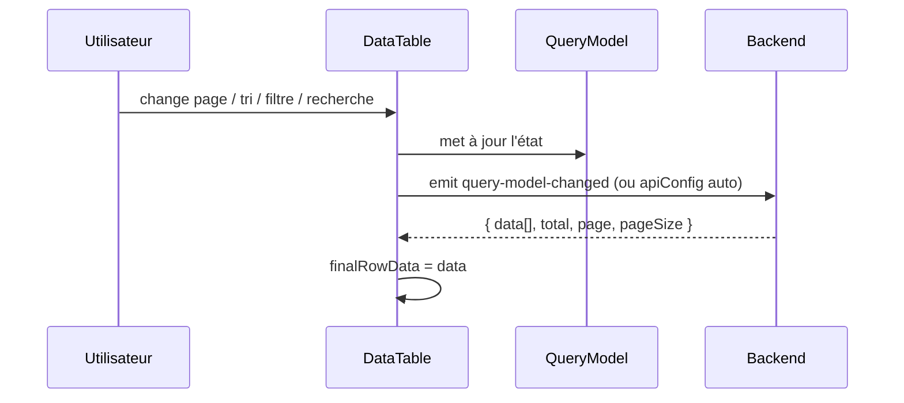

# DataTable — Documentation complète

> Package : `@SMATCH-Digital-dev/vue-system-design`  
> Dernière révision documentée : **v1.1.25**  
> Chemin source : `vue-system-design/src/components/DataTable/`

---

## Table des matières

1. [Vue d'ensemble](#1-vue-densemble)
2. [Installation et import](#2-installation-et-import)
3. [Démarrage rapide](#3-démarrage-rapide)
4. [Architecture](#4-architecture)
5. [Composants exportés](#5-composants-exportés)
6. [Props DataTable](#6-props-datatable)
7. [Événements](#7-événements)
8. [QueryModel](#8-querymodel)
9. [Configuration des colonnes](#9-configuration-des-colonnes)
10. [Actions par ligne](#10-actions-par-ligne)
11. [Pagination](#11-pagination)
12. [Tri et filtres](#12-tri-et-filtres)
13. [Recherche globale](#13-recherche-globale)
14. [Mode API (server-side)](#14-mode-api-server-side)
15. [Sélection, clic ligne, édition](#15-sélection-clic-ligne-édition)
16. [Groupement et agrégations](#16-groupement-et-agrégations)
17. [Master / Detail et données imbriquées](#17-master--detail-et-données-imbriquées)
18. [Colonnes : visibilité, épinglage, redimensionnement](#18-colonnes--visibilité-épinglage-redimensionnement)
19. [Virtual scrolling et hauteur](#19-virtual-scrolling-et-hauteur)
20. [Export](#20-export)
21. [Persistance (localStorage)](#21-persistance-localstorage)
22. [Navigation clavier](#22-navigation-clavier)
23. [États vides et forbidden](#23-états-vides-et-forbidden)
24. [Styles et thème M3](#24-styles-et-thème-m3)
25. [Constantes](#25-constantes)
26. [Helpers et types exportés](#26-helpers-et-types-exportés)
27. [Exemples complets](#27-exemples-complets)
28. [Dépannage](#28-dépannage)
29. [Carte des fichiers](#29-carte-des-fichiers)

---

## 1. Vue d'ensemble

Le **DataTable** est un tableau de données Vue 3 orienté **applications métier** :

- Pagination, tri, filtres et recherche pilotés par un **QueryModel** unique
- Chargement **server-side** via `apiConfig` ou données manuelles via `rowDataProp`
- Chrome UI **Material Design 3** (toolbar, header, pagination, drawer colonnes)
- Fonctionnalités avancées : sélection, édition inline, groupement, agrégations, colonnes épinglées, virtual scrolling, master/detail

### Principes

| Principe | Détail |
|----------|--------|
| Server-side | Le parent (ou `apiConfig`) fournit **une page** de données + le **total** |
| QueryModel | Tous les changements utilisateur produisent un `QueryModel` réutilisable pour l'API |
| Hauteur (v1.1.25+) | Par défaut `autoHeight: true` → hauteur = contenu (pas de zone blanche avec 1 ligne) |

---

## 2. Installation et import

```bash
npm install @SMATCH-Digital-dev/vue-system-design@1.1.25
```

Configurer `.npmrc` pour GitHub Packages (voir `INSTALLATION.md` du package).

### Import dans une app Vue 3

```typescript
import DataTable, { QueryModelTable } from '@SMATCH-Digital-dev/vue-system-design'

import type {
  DataTableColumn,
  DataTableProps,
  ActionConfig,
  QueryModel,
} from '@SMATCH-Digital-dev/vue-system-design'

import {
  createEmptyQueryModel,
  mergeQueryModelUpdate,
  useQueryModel,
} from '@SMATCH-Digital-dev/vue-system-design'
```

### Projet démo (`smatch-system-design-vue`)

Alias Vite : `@/components/DataTable` → `vue-system-design/src/components/DataTable`.

Les styles M3 du tableau sont chargés automatiquement par `DataTable.vue` :

```typescript
import './styles/data-table-chrome.css'
```

---

## 3. Démarrage rapide

### Option A — `QueryModelTable` (recommandé)

```vue
<template>
  <QueryModelTable
    v-model:query-model="queryModel"
    :columns="columns"
    :row-data-prop="rows"
    :loading="loading"
    :total-items-prop="total"
    storage-key="products-list"
    @query-model-changed="fetchPage"
  />
</template>

<script setup lang="ts">
import { ref } from 'vue'
import { QueryModelTable, createEmptyQueryModel } from '@SMATCH-Digital-dev/vue-system-design'
import type { DataTableColumn, QueryModel } from '@SMATCH-Digital-dev/vue-system-design'

const queryModel = ref(createEmptyQueryModel())
const rows = ref<Record<string, unknown>[]>([])
const loading = ref(false)
const total = ref(0)

const columns: DataTableColumn[] = [
  { field: 'id', headerName: 'ID', sortable: true, width: 72 },
  { field: 'name', headerName: 'Nom', sortable: true, filterable: true },
  { field: 'status', headerName: 'Statut', dataType: 'badge', filterable: true },
]

async function fetchPage(qm: QueryModel) {
  loading.value = true
  try {
    const res = await fetch(`/api/products?${buildQuery(qm)}`)
    const json = await res.json()
    rows.value = json.data
    total.value = json.total
  } finally {
    loading.value = false
  }
}
</script>
```

### Option B — `DataTable` direct

```vue
<DataTable
  :columns="columns"
  :row-data-prop="rows"
  :loading="loading"
  :current-page-prop="page"
  :total-items-prop="total"
  :page-size-prop="pageSize"
  @query-model-changed="fetchPage"
/>
```

---

## 4. Architecture

```
DataTable.vue
├── DataTableToolbar.vue      (édition batch, pivot — si activés)
├── TableHeader.vue           (recherche, exports, colonnes, groupes)
├── Pagination.vue            (si pagination !== false)
├── TableBody.vue             (grille, filtres colonnes, sélection, VS)
└── ColumnManager.vue         (drawer Teleport → body)

Logique : useDataTableComponent.ts
├── useDataTable              état colonnes, pagination locale, sélection
├── useQueryModel             modèle requête
├── useDataTableServerSide    émission QueryModel sur interactions
├── useDataTableApi           fetch automatique si apiConfig
├── useColumnPinning          colonnes figées
├── grouping / editing / pivot / masterDetail
└── finalRowData (computed)   → TableBody.paginatedData
```

### Flux server-side



---

## 5. Composants exportés

| Export | Rôle |
|--------|------|
| `DataTable` (défaut) | Composant principal |
| `QueryModelTable` | Wrapper avec `v-model:query-model` |
| `useQueryModel` | Composable état QueryModel |
| `createEmptyQueryModel` | QueryModel initial |
| `mergeQueryModelUpdate` | Fusion partielle |
| `queryModelToPaginationProps` | Dérive page/pageSize pour props legacy |
| `createApiConfig`, `useDataTableApiConfig`, … | Helpers API |

---

## 6. Props DataTable

### 6.1 Données (requises / courantes)

| Prop | Type | Défaut | Description |
|------|------|--------|-------------|
| `columns` | `DataTableColumn[]` | — | **Requis.** Définition des colonnes |
| `rowDataProp` | `T[]` | `[]` | Lignes de la **page courante** |
| `loading` | `boolean` | `false` | Affiche le skeleton |
| `apiConfig` | `DataTableApiConfig` | — | Chargement HTTP automatique |
| `dataUrl` | `string` | — | URL legacy |
| `mode` | `'querymodel' \| 'datatable' \| 'rest' \| 'custom'` | `'querymodel'` | Format paramètres API |

### 6.2 Pagination

| Prop | Type | Défaut | Description |
|------|------|--------|-------------|
| `pagination` | `boolean` | `true` | Affiche le composant Pagination |
| `currentPageProp` | `number` | `1` | Page (base 1) |
| `totalPagesProp` | `number` | — | Optionnel |
| `totalItemsProp` | `number` | `0` | Total enregistrements côté serveur |
| `pageSizeProp` | `number` | `50` | Taille de page |
| `pageSizeOptions` | `number[]` | `[50,100,500,1000,0]` | `0` = **Tout** (+ virtual scrolling si seuil atteint) |

### 6.3 Interaction

| Prop | Type | Défaut | Description |
|------|------|--------|-------------|
| `enableFiltering` | `boolean` | `true` | Filtres par colonne |
| `enableGlobalSearch` | `boolean` | `true` | Champ recherche dans la toolbar |
| `rowSelection` | `boolean` | `false` | Colonne checkbox |
| `showColumnSelector` | `boolean` | `true` | Bouton gestion des colonnes |
| `enableRowClick` | `boolean` | `false` | Émet `row-clicked` |
| `rowClickMode` | `'single' \| 'double' \| 'both'` | `'double'` | Type de clic |
| `storageKey` | `string` | `'datatable'` | Clé localStorage |
| `actions` | `ActionConfig[]` | `[]` | Menu actions par ligne |
| `advancedFilters` | `object` | `{}` | Filtres avancés custom |
| `forbidden` | `boolean` | `false` | État permissions insuffisantes |

### 6.4 Affichage et layout

| Prop | Type | Défaut | Description |
|------|------|--------|-------------|
| `autoHeight` | `boolean` | **`true`** | Hauteur selon le nombre de lignes |
| `autoColumnWidth` | `boolean` | `true` | `table-layout: auto` |
| `defaultVisibleColumnsCount` | `number` | `50` | Colonnes visibles au chargement |
| `exportTitle` | `string` | — | Titre pour exports |
| `iconMap` | `Record<string, unknown>` | — | Icônes actions |

**`autoHeight` (v1.1.25+)**

- `true` (défaut) : `height: auto` sur le conteneur → **1 ligne = petite hauteur**, pas de bande blanche.
- `false` : viewport = `min(lignes, 20) × 60.1px` + en-tête, scroll si plus de lignes.

### 6.5 Fonctionnalités avancées

| Prop | Défaut | Description |
|------|--------|-------------|
| `inlineEditing` | `false` | Édition cellule |
| `enableAdvancedEditing` | `false` | Toolbar save/discard batch |
| `enableGrouping` | `false` | Groupement de lignes |
| `groupingConfig` | — | `{ fields, expandable, aggregators }` |
| `enablePivot` | `false` | Table pivot |
| `enableMasterDetail` | `false` | Lignes détail expandables |
| `enableMultiSort` | `true` | Ctrl + clic en-têtes |
| `enableColumnPinning` | `true` | Colonnes figées gauche/droite |
| `enableColumnResize` | `true` | Redimensionnement colonnes |
| `enableVirtualScrolling` | — | VS manuel |
| `virtualScrollingConfig` | — | Voir [§19](#19-virtual-scrolling-et-hauteur) |
| `enableInfiniteScroll` | `false` | Scroll infini |
| `enableSetFilters` | `false` | Filtres liste valeurs uniques |
| `enableDynamicColumns` | — | Colonnes auto depuis les données |
| `debounceFilter` | — | Debounce filtres (ms) |
| `customDataTableParams` | — | Params API additionnels |

### 6.6 États personnalisés

```typescript
emptyStateConfig?: {
  title?: string
  description?: string
  icon?: Component
  actions?: Array<{ label: string; onClick: () => void; primary?: boolean }>
}

forbiddenStateConfig?: { /* même forme */ }
```

### 6.7 `apiConfig`

```typescript
apiConfig: {
  endpoint: string
  format?: 'rest' | 'datatable'
  method?: 'GET' | 'POST'
  headers?: Record<string, string>
  transformParams?: (queryModel: QueryModel) => Record<string, unknown>
  transformResponse?: (response) => {
    data: T[]
    total: number
    filtered?: number
    page: number
    pageSize: number
    totalPages: number
  }
  autoLoad?: boolean
  serverSidePagination?: boolean  // true si apiConfig présent
  serverSideSorting?: boolean
  serverSideFiltering?: boolean
}
```

---

## 7. Événements

| Événement | Payload | Description |
|-----------|---------|-------------|
| **`query-model-changed`** | `QueryModel` | **Principal** — tout changement requête |
| `pagination-changed` | `QueryModel` | Page changée |
| `page-size-changed` | `QueryModel` | Taille de page |
| `sort-changed` | `QueryModel` | Tri |
| `filter-changed` | `QueryModel` | Filtres |
| `global-search-changed` | `QueryModel` | Recherche globale |
| `selection-changed` | `Set<string>` | IDs lignes sélectionnées |
| `row-clicked` | `rowId: string` | Clic / double-clic ligne |
| `cell-value-changed` | `{ data, field, oldValue, newValue }` | Édition inline |
| `export-csv` | — | À implémenter côté app |
| `export-spreadsheet` | — | Export Excel |
| `export-pdf` | — | Export PDF |
| `export-selected-csv` | — | Export sélection CSV |
| `export-selected-spreadsheet` | — | Export sélection Excel |
| `api-data-loaded` | `{ data, total, page, pageSize, totalPages }` | Après fetch `apiConfig` |
| `api-error` | `Error` | Erreur API |
| `table-state-changed` | `TableState` | Persistance état |
| `save-state` | `TableState` | Sauvegarde état |
| `grouping-changed` | `groups` | Groupement |
| `pivot-changed` | `pivotData` | Pivot |
| `master-detail-changed` | `detailState` | Master/detail |

---

## 8. QueryModel

Contrat unifié pour pagination, tri, filtres et recherche.

```typescript
interface QueryModel {
  page?: number              // commence à 1
  pageSize?: number
  sort?: Array<{ colId: string; sort: 'asc' | 'desc' }>
  filters?: Record<string, {
    operator: FilterOperator
    value?: FilterValueType
    value2?: FilterValueType
    values?: FilterValueType[]
    dataType?: string
  }>
  search?: string
  customParams?: Record<string, unknown>
}
```

### Opérateurs de filtre

`equals`, `not_equals`, `contains`, `not_contains`, `starts_with`, `ends_with`, `greater_than`, `less_than`, `greater_equal`, `less_equal`, `between`, `in`, `not_in`, `is_null`, `is_not_null`, `is_empty`, `is_not_empty`, `regex`.

### Exemple payload API

```json
{
  "page": 2,
  "pageSize": 50,
  "search": "paris",
  "sort": [{ "colId": "name", "sort": "asc" }],
  "filters": {
    "status": { "operator": "equals", "value": "active" }
  }
}
```

---

## 9. Configuration des colonnes

### Interface `DataTableColumn`

```typescript
interface DataTableColumn<T = Record<string, unknown>> {
  field: string
  headerName?: string
  description?: string
  dataType?: ColumnDataType
  sortable?: boolean
  filterable?: boolean
  editable?: boolean
  visible?: boolean
  hide?: boolean
  width?: number
  minWidth?: number
  maxWidth?: number
  flex?: number
  align?: 'left' | 'center' | 'right'
  priority?: number
  responsive?: { hideBelow?: 'sm'|'md'|...; showAbove?: 'lg'|... }
  valueFormatter?: (params) => string
  cellRenderer?: string | Function
  cellStyle?: (params) => Record<string, string> | string
  cellClass?: string | ((params) => string)
  filterConfig?: FilterConfig
  aggregation?: { type: 'sum'|'avg'|'min'|'max'|'count'|'custom'; ... }
  nestedData?: { key, columns?, expandable?, ... }
  badgeStyles?: Array<{ value: string; class: string; icon? }>
  options?: Array<{ label: string; value: unknown }>
  linkTo?: (row: T) => string | null
  linkUseRouter?: boolean
  navigable?: boolean
  // … voir types/dataTable.ts pour la liste complète
}
```

### Types `dataType`

| Type | Rendu |
|------|--------|
| `text` | Texte |
| `number`, `currency`, `percentage` | Nombres formatés |
| `date`, `datetime` | Dates |
| `boolean` | Booléen |
| `select`, `enum` | Liste / badge |
| `email`, `url`, `phone` | Liens spécialisés |
| `image`, `file` | Médias |
| `badge`, `status` | Badges colorés |
| `progress` | Barre de progression |
| `link` | Lien cliquable |
| `relation`, `calculated` | Données dérivées |
| `textarea` | Texte long |
| `action` | Actions inline |

### Exemple colonnes riches

```typescript
const columns: DataTableColumn[] = [
  {
    field: 'amount',
    headerName: 'Montant',
    dataType: 'currency',
    currency: 'EUR',
    sortable: true,
    aggregation: { type: 'sum', label: 'Total' },
  },
  {
    field: 'status',
    headerName: 'Statut',
    dataType: 'badge',
    filterable: true,
    badgeStyles: [
      { value: 'active', class: 'bg-green-100 text-green-800' },
      { value: 'inactive', class: 'bg-gray-100 text-gray-600' },
    ],
  },
  {
    field: 'name',
    headerName: 'Commande',
    dataType: 'link',
    linkTo: (row) => `/orders/${row.id}`,
    linkUseRouter: true,
  },
  {
    field: 'lines',
    headerName: 'Lignes',
    nestedData: {
      key: 'items',
      expandable: true,
      columns: [
        { field: 'sku', headerName: 'SKU' },
        { field: 'qty', headerName: 'Qté' },
      ],
    },
  },
]
```

---

## 10. Actions par ligne

```typescript
const actions: ActionConfig[] = [
  {
    label: 'Modifier',
    icon: IconEdit,
    color: 'primary',
    onClick: (row) => router.push(`/edit/${row.id}`),
    show: (row) => row.editable !== false,
    disabled: (row) => row.locked === true,
    tooltip: 'Éditer',
  },
  {
    label: 'Supprimer',
    color: 'danger',
    onClick: (row) => confirmDelete(row),
  },
]
```

Colonne **Actions** : largeur 120px, sticky à droite.

---

## 11. Pagination

- Affichée **au-dessus** du corps du tableau (sous la toolbar).
- Affichage unifié via `resolvePaginationDisplay()` : `start`, `end`, `total`, `hasNext`, `hasPrevious`.
- **Page size `0`** : affiche toutes les lignes de la page courante ; active le virtual scrolling si le seuil est dépassé.

Côté parent server-side :

```typescript
// Toujours synchroniser après fetch :
rows.value = response.data        // page courante uniquement
total.value = response.total      // total filtré côté serveur
currentPage.value = response.page
pageSize.value = response.pageSize
```

---

## 12. Tri et filtres

### Tri

- Clic sur libellé d'en-tête : `asc` → `desc` → aucun.
- `enableMultiSort: true` : maintenir **Ctrl** pour tri secondaire.

### Filtres par colonne

- Icône filtre dans l'en-tête → panneau `FilterDropdown`.
- Debounce par défaut : **300 ms** (`DEBOUNCE_FILTER_DELAY`).
- `minHeight` du conteneur augmenté **uniquement** quand un filtre colonne est ouvert (évite de couper le dropdown).

### Filtres avancés

- Prop `advancedFilters` + composant `AdvancedFilter.vue` pour groupes AND/OR.

---

## 13. Recherche globale

- Champ dans `TableHeader`.
- Debounce : **500 ms** (`DEBOUNCE_SEARCH_DELAY`).
- Met à jour `QueryModel.search`.
- Indicateur « filtres actifs » + bouton effacer tout.

---

## 14. Mode API (server-side)

```vue
<DataTable
  :columns="columns"
  :api-config="{
    endpoint: '/api/v1/users',
    format: 'rest',
    autoLoad: true,
    headers: { Authorization: `Bearer ${token}` },
  }"
  @api-data-loaded="onLoaded"
  @api-error="onError"
/>
```

Formats de réponse supportés :

- **REST** : `{ data, count/total, page, pageSize }`
- **DataTable** : `{ data, recordsTotal, recordsFiltered, … }`

Service : `services/dataTableApiService.ts` — validation via `DataTableService.validateResponse()`.

---

## 15. Sélection, clic ligne, édition

### Sélection

```vue
<DataTable
  :row-selection="true"
  @selection-changed="(ids) => console.log([...ids])"
/>
```

- Checkbox par ligne + sélection globale en en-tête.
- Export sélection : `@export-selected-csv`, `@export-selected-spreadsheet`.

### Clic ligne

```vue
<DataTable
  :enable-row-click="true"
  row-click-mode="single"
  @row-clicked="(rowId) => openDetail(rowId)"
/>
```

### Édition inline

```vue
<DataTable
  :inline-editing="true"
  @cell-value-changed="({ data, field, newValue, oldValue }) => saveCell(data, field, newValue)"
/>
```

### Édition batch

```vue
<DataTable
  :enable-advanced-editing="true"
  :editing-config="{ fields: ['name','qty'], saveMode: 'batch' }"
/>
```

Toolbar : activer mode batch, sauvegarder tout, annuler tout.

---

## 16. Groupement et agrégations

```vue
<DataTable
  :enable-grouping="true"
  :grouping-config="{
    fields: ['country', 'city'],
    expandable: true,
    aggregators: { amount: 'sum', id: 'count' },
  }"
/>
```

- Toolbar : expand all / collapse all.
- Footer : agrégations globales via `column.aggregation`.
- `TableBodyGrouped` / `TableGroupRow` pour le rendu hiérarchique.

---

## 17. Master / Detail et données imbriquées

### Master / Detail

```vue
<DataTable
  :enable-master-detail="true"
  :master-detail-config="{
    detailDataProvider: async (row) => fetchOrderLines(row.id),
    lazyLoading: true,
  }"
/>
```

### Nested data (colonne)

Voir `column.nestedData` — sous-tableau expandable dans la cellule.

---

## 18. Colonnes : visibilité, épinglage, redimensionnement

### Gestionnaire de colonnes (drawer)

- Bouton dans `TableHeader` si `showColumnSelector: true`.
- Drawer plein écran à droite (`Teleport` → `body`).
- Réordonnancement drag & drop, visibilité, épinglage.

### Épinglage

- Colonnes figées : sélection, `#`, expander, puis colonnes `pinned: left`.
- Colonne actions : `pinned: right`.
- Ombre `dt-cell--pin-shadow` après le bloc figé.

### Redimensionnement

- `enableColumnResize: true` (défaut).
- Largeurs persistées via `storageKey`.

---

## 19. Virtual scrolling et hauteur

### Constantes de hauteur

| Constante | Valeur | Rôle |
|-----------|--------|------|
| `DEFAULT_ROW_HEIGHT` | 60.1 px | Hauteur ligne CSS |
| `STANDARD_HEADER_HEIGHT` | 50 px | En-tête |
| `STANDARD_VISIBLE_ROWS` | 20 | Plafond viewport mode fixe |
| `VIRTUAL_SCROLLING_THRESHOLD` | 2000 | Seuil activation VS |

### Comportement `autoHeight`

| `autoHeight` | 1 ligne | 100 lignes |
|--------------|---------|------------|
| `true` (défaut) | ~110 px total | Hauteur contenu ou VS si seuil |
| `false` | ~110 px (viewport = 1 ligne) | max 20 lignes visibles + scroll |

Structure DOM (`TableBody`) :

```html
<div class="datatable-container" :style="tableContainerStyle">
  <div class="datatable-inner-scroll w-full min-h-0">
    <table class="datatables-table" style="--dt-min-body-rows: N">
      <thead class="datatables-thead">…</thead>
      <tbody>…</tbody>
      <tfoot>…agrégations…</tfoot>
    </table>
  </div>
</div>
```

CSS clé :

```css
.datatables-table {
  min-height: calc(
    var(--dt-header-height) +
    var(--dt-row-height) * var(--dt-min-body-rows)
  );
}
```

`--dt-min-body-rows` = **nombre réel de lignes** (1 pour une ligne).

### Virtual scrolling

```vue
<DataTable
  :enable-virtual-scrolling="true"
  :virtual-scrolling-config="{
    itemHeight: 60.1,
    overscan: 15,
    threshold: 2000,
    withPagination: true,
    paginationThreshold: 25,
  }"
/>
```

---

## 20. Export

Le DataTable **émet** ; l'application implémente le téléchargement :

```vue
<DataTable
  @export-csv="downloadCsv"
  @export-spreadsheet="downloadXlsx"
  @export-pdf="downloadPdf"
  @export-selected-csv="downloadSelectedCsv"
/>
```

Service interne : `services/dataTableExportService.ts`.

---

## 21. Persistance (localStorage)

```vue
<DataTable storage-key="inventory-table-v2" />
```

Sauvegarde (debounce 500 ms) :

- Colonnes visibles et ordre
- Largeurs
- Filtres et tri
- Pagination
- Épinglage / sticky header

---

## 22. Navigation clavier

Activée par défaut (`enableCellNavigation: true` sur `TableBody`).

| Touche | Action |
|--------|--------|
| Flèches | Déplacement entre cellules |
| Tab / Shift+Tab | Cellule suivante / précédente |
| Enter | Lien (`link` / `linkTo`) ou début édition |
| Espace | Toggle sélection ligne |
| Ctrl+Home / Ctrl+End | Première / dernière cellule |

En édition : Enter sauvegarde, Escape annule, Tab passe à la cellule éditable suivante.

---

## 23. États vides et forbidden

| État | Déclencheur | Props |
|------|-------------|-------|
| Vide | `rowDataProp.length === 0` | `emptyStateConfig` |
| Forbidden | `forbidden: true` | `forbiddenStateConfig` |
| Filtres actifs sans résultat | données vides + filtres/recherche | message adapté dans TableBody |

---

## 24. Styles et thème M3

Fichier principal : `styles/data-table-chrome.css`.

Variables CSS :

- `--dt-chrome-*` : toolbar, header, surfaces M3
- `--dt-grid-*` : corps, rayures, hover, sélection
- Liées à `--md-sys-color-*` et `--color-*` (thème Prolog / dark mode)

Classes utiles :

- `.data-table` — racine
- `.datatable-container` — bordure + scroll
- `.dt-header-bar` — toolbar recherche/boutons
- `.dt-btn--outlined`, `.dt-btn--tonal`, `.dt-btn--filled`
- `.datatables-row`, `.dt-row-selected`
- `.dt-drawer-overlay`, `.dt-drawer-panel` — gestion colonnes

---

## 25. Constantes

Fichier : `constants.ts` → `DATA_TABLE_CONSTANTS`.

```typescript
DEFAULT_PAGE_SIZE: 50
PAGE_SIZE_OPTIONS: [50, 100, 500, 1000, 0]
DEFAULT_ROW_HEIGHT: 60.1
STANDARD_HEADER_HEIGHT: 50
STANDARD_VISIBLE_ROWS: 20
DEBOUNCE_FILTER_DELAY: 300
DEBOUNCE_SEARCH_DELAY: 500
VIRTUAL_SCROLLING_THRESHOLD: 2000
SELECTION_COLUMN_WIDTH: 40
ROW_NUMBER_COLUMN_WIDTH: 44
```

---

## 26. Helpers et types exportés

```typescript
// types
export type { QueryModel, SortModel, FilterModel } from './types/QueryModel'
export type { DataTableColumn, DataTableProps, ActionConfig } from './types/dataTable'

// composables
export { useQueryModel } from './composables/useQueryModel'
export { createApiConfig, useDataTableApiConfig } from './composables/useDataTableApiConfig'

// utils
export { createEmptyQueryModel } from './utils/queryModelHelpers'
export { mergeQueryModelUpdate, queryModelToPaginationProps } from './utils/queryModelTableBridge'
export { resolvePaginationDisplay } from './utils/paginationUtils'
```

---

## 27. Exemples complets

### Server-side manuel (sans apiConfig)

```vue
<template>
  <QueryModelTable
    v-model:query-model="qm"
    :columns="columns"
    :row-data-prop="rows"
    :loading="loading"
    :total-items-prop="total"
    :row-selection="true"
    :enable-column-pinning="true"
    :auto-height="true"
    @query-model-changed="load"
    @selection-changed="onSelect"
  />
</template>

<script setup lang="ts">
import { ref } from 'vue'
import {
  QueryModelTable,
  createEmptyQueryModel,
} from '@SMATCH-Digital-dev/vue-system-design'
import type { QueryModel, DataTableColumn } from '@SMATCH-Digital-dev/vue-system-design'

const qm = ref(createEmptyQueryModel())
const rows = ref<Record<string, unknown>[]>([])
const total = ref(0)
const loading = ref(false)

const columns: DataTableColumn[] = [
  { field: 'id', headerName: 'ID', width: 80, sortable: true },
  { field: 'label', headerName: 'Libellé', filterable: true, sortable: true },
]

async function load(query: QueryModel) {
  loading.value = true
  try {
    const r = await fetch('/api/items', {
      method: 'POST',
      headers: { 'Content-Type': 'application/json' },
      body: JSON.stringify(query),
    }).then((res) => res.json())
    rows.value = r.data
    total.value = r.total
  } finally {
    loading.value = false
  }
}

function onSelect(ids: Set<string>) {
  console.log('selected', [...ids])
}
</script>
```

### Viewport fixe type « DataTables classique »

```vue
<DataTable
  :columns="columns"
  :row-data-prop="rows"
  :auto-height="false"
  :total-items-prop="total"
/>
```

---

## 28. Dépannage

| Problème | Cause probable | Solution |
|----------|----------------|----------|
| Grande zone blanche avec 1 ligne | `autoHeight: false` ou ancienne version | `autoHeight: true` (défaut v1.1.25+) ou mettre à jour le package |
| Total / pages incohérents | `totalItemsProp` non mis à jour | Synchroniser après chaque fetch API |
| Pas de données après filtre | Backend ignore QueryModel | Vérifier mapping `filters` / `search` |
| Colonnes pas sauvegardées | `storageKey` différent ou localStorage bloqué | Clé stable par écran |
| Filtre coupé | minHeight insuffisant | Comportement corrigé : minHeight seulement filtre ouvert |
| Double fetch au montage | `apiConfig.autoLoad` + fetch manuel | Désactiver l'un des deux |
| Copie locale `smatch-system-design-vue-main/` | Dossier non synchronisé | Utiliser `vue-system-design/` (alias Vite) |

---

## 29. Carte des fichiers

| Fichier | Rôle |
|---------|------|
| `DataTable.vue` | Composant racine |
| `QueryModelTable.vue` | Wrapper v-model QueryModel |
| `TableBody.vue` | Grille, hauteur, VS, filtres inline |
| `TableHeader.vue` | Toolbar principale |
| `Pagination.vue` | Pagination |
| `ColumnManager.vue` | Drawer colonnes |
| `DataTableToolbar.vue` | Barre secondaire |
| `composables/useDataTableComponent.ts` | Orchestration |
| `composables/useDataTableServerSide.ts` | Server-side + emits |
| `composables/useDataTableApi.ts` | Fetch API |
| `types/dataTable.ts` | Types colonnes / props |
| `types/QueryModel.ts` | Modèle requête |
| `services/dataTableApiService.ts` | HTTP |
| `services/cellRenderers.ts` | Rendu cellules |
| `styles/data-table-chrome.css` | Thème M3 |
| `constants.ts` | Constantes |
| `README.md` | Guide rapide |
| `ARCHITECTURE-ET-WORKFLOW.md` | Architecture détaillée |
| `CHECKLIST-INTEGRATION-DATATABLE.md` | Checklist intégration |

---

## Références

- Démo interactive : `src/views/display.vue` (projet racine)
- Tests : `__tests__/DataTable.spec.ts`, `Pagination.spec.ts`
- Publication : `vue-system-design/scripts/publish-private.js`

---

*Document généré pour `@SMATCH-Digital-dev/vue-system-design` — maintenir ce fichier lors des changements majeurs de props ou de comportement.*
