# 🏗️ Diagramme d'Architecture - Inventaire WMS

## 📐 Architecture Générale

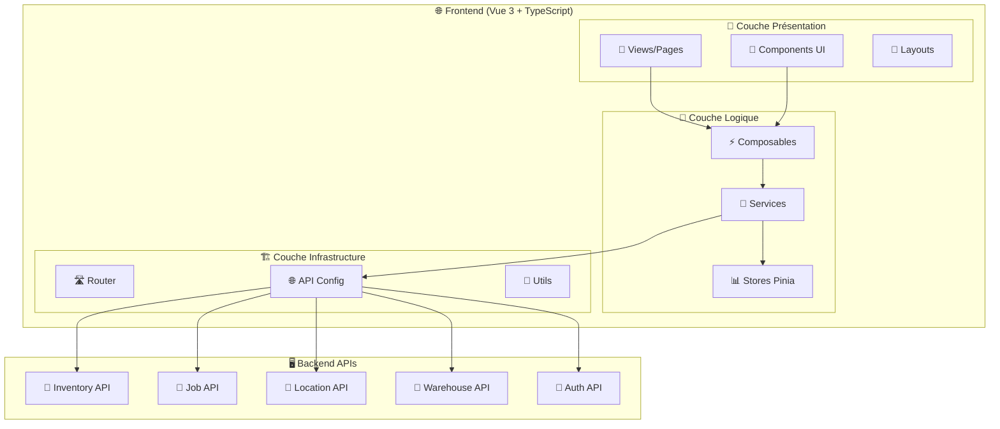

## 🔄 Flux de Données

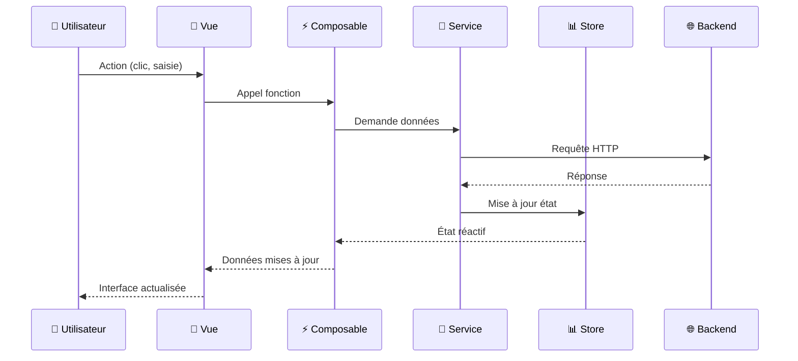

## 🏢 Architecture par Modules

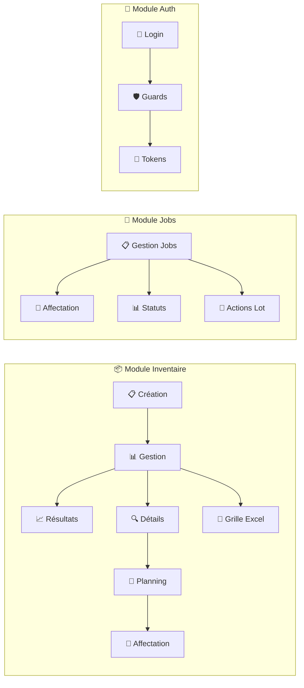

## 📊 Structure DataTable

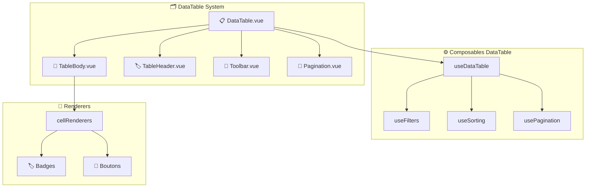

## 🔄 Gestion d'État

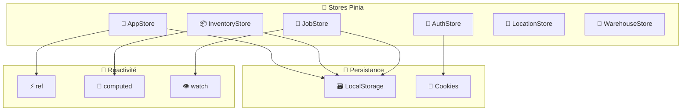

## 🎯 Architecture Composables

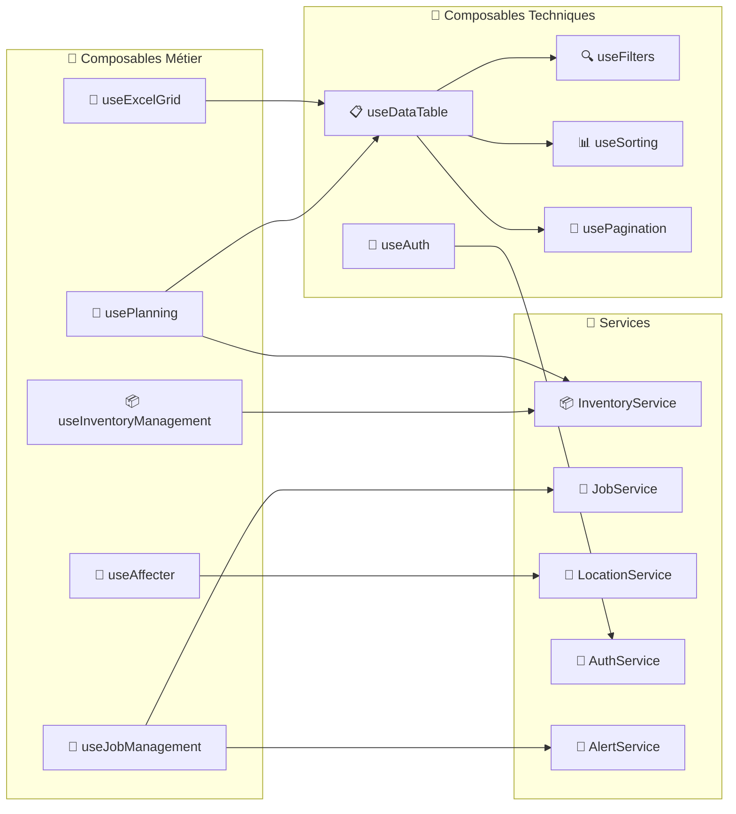

## 🌐 Configuration API

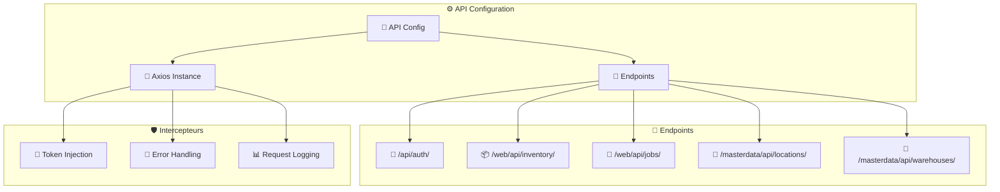

## 🎨 Design System

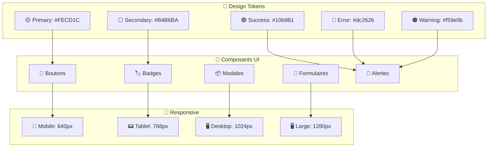

## 🚀 Déploiement

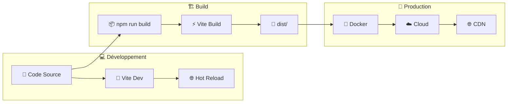

## 📈 Performance

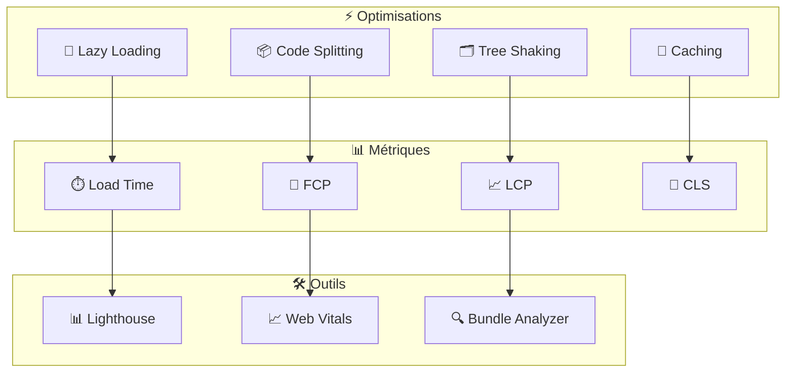

## 🔮 Évolutions Futures

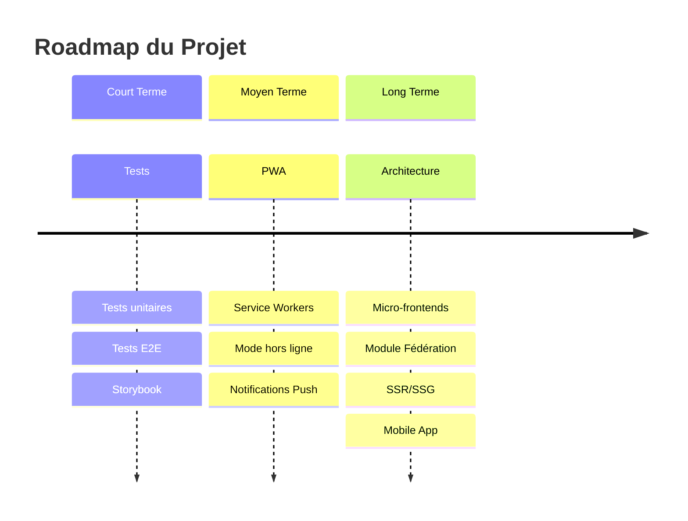
